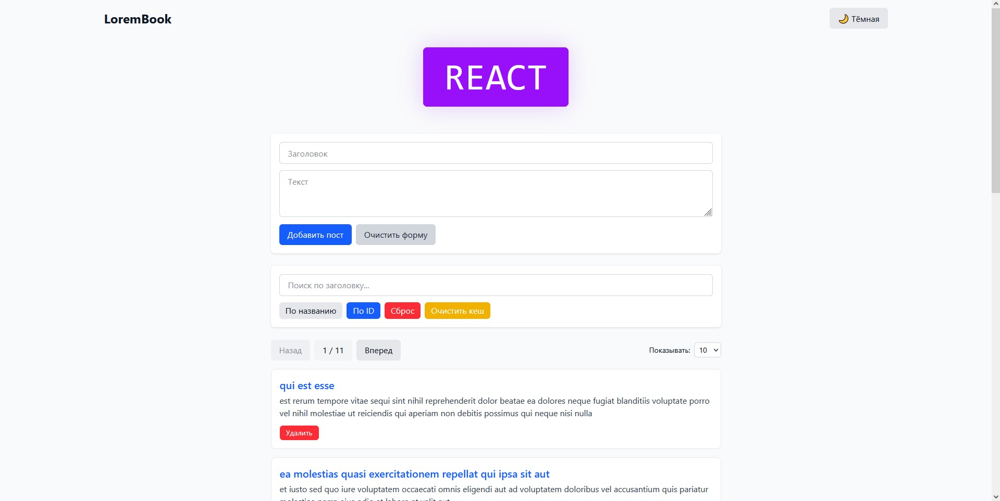
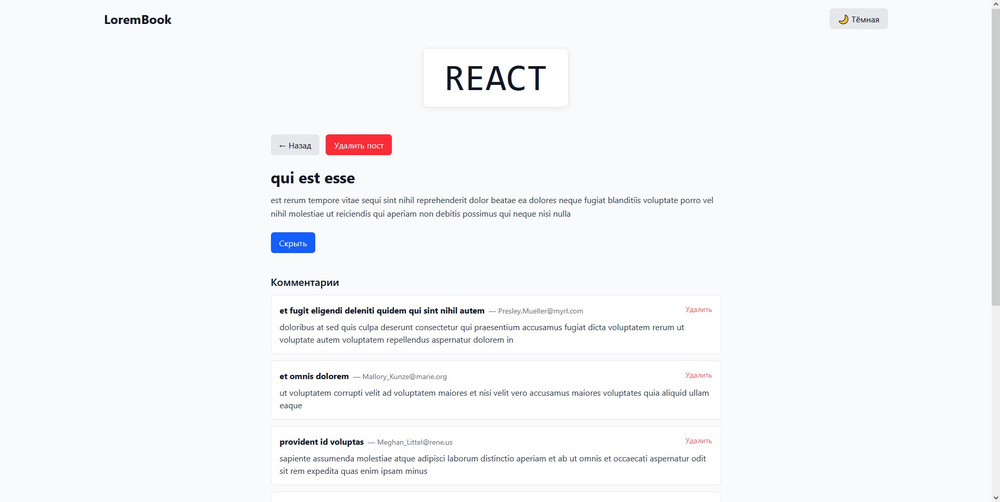
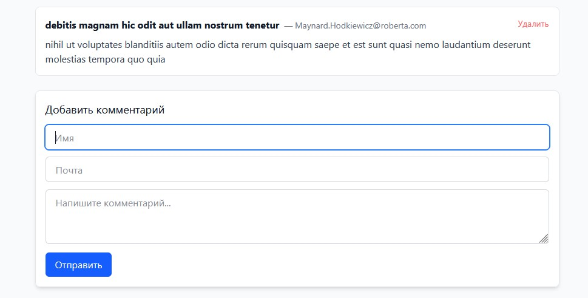

# 📚 LoremBook

Блоговое приложение на React с поддержкой постов и комментариев, кешированием и тёмной темой.

## 🚀 Демо

[Смотреть онлайн](https://lorembook.vercel.app/)

## 📸 Скриншоты





## 🛠️ Технологии

- **React 18** – интерфейс
- **React Router v6** – навигация
- **Zustand** – глобальное состояние
- **Tailwind CSS** – стилизация
- **Vite** – сборка
- **localStorage** – кеширование
- **Vercel** – хостинг

## 📂 Архитектура

Проект построен по методологии **Feature Sliced Design (FSD)**:

- `app/` – настройка приложения (роутинг, тема, лейаут)
- `pages/` – страницы (HomePage, PostPage, NotFound)
- `features/` – пользовательские сценарии (добавление постов, комментариев, пагинация)
- `entities/` – бизнес-сущности (посты, комментарии)
- `shared/` – переиспользуемые утилиты (хранилище, хуки, контекст)

## 🧩 Функциональность

- Список постов (пагинация, поиск, сортировка)
- Добавление и удаление постов
- Просмотр поста с комментариями
- Добавление и удаление комментариев
- Кеширование в localStorage
- Тёмная / светлая тема
- Адаптивный дизайн

## 🚀 Запуск локально

```bash
# Клонируй репозиторий
git clone https://github.com/Schuwarz/LearnReact2.git
cd LearnReact2

# Установи зависимости
npm install

# Запусти dev-сервер
npm run dev